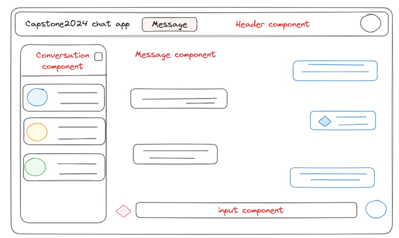
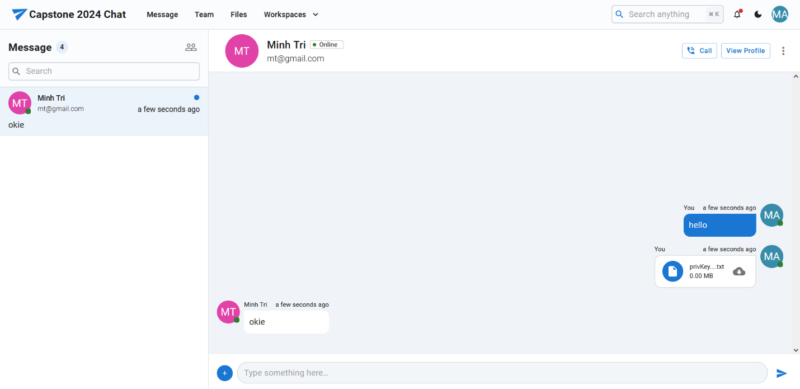
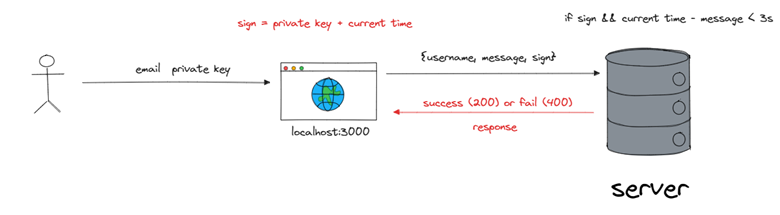
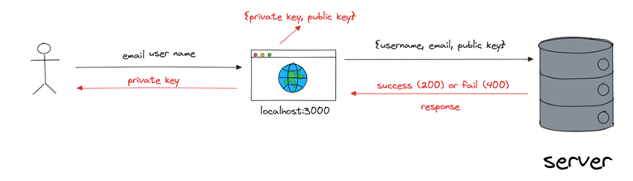
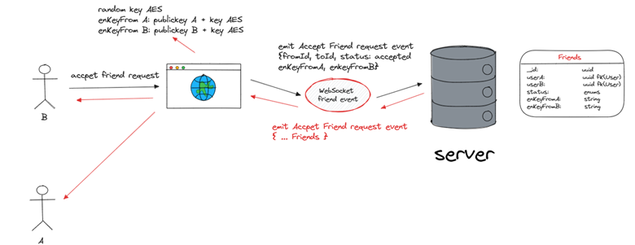
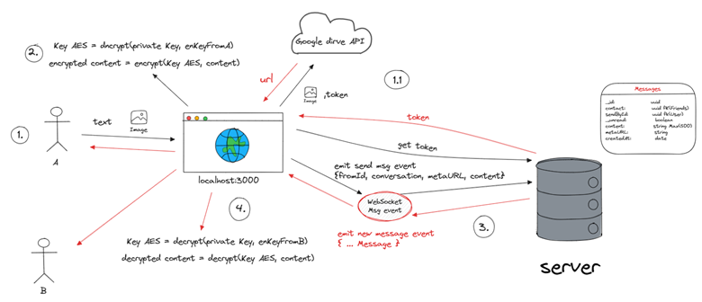
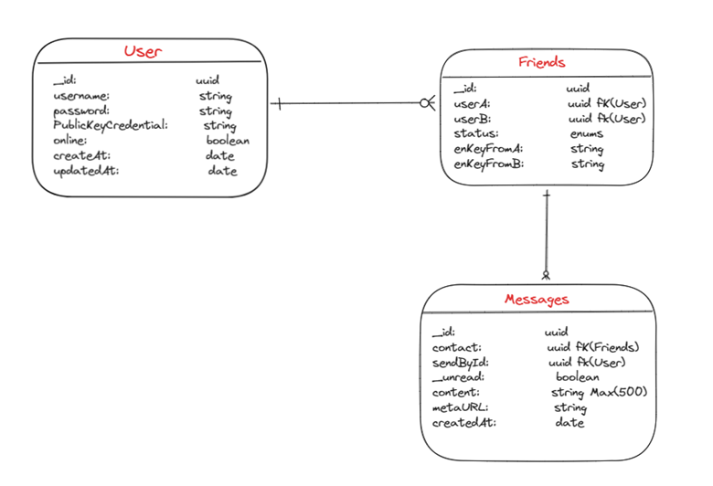

# 🔒 file-transfer

In today’s interconnected world, ensuring the privacy and security of communication is paramount. Our goal is to build a robust application that allows users to exchange messages and files securely. Here’s how our application will work:

1. User Authentication:

   - Users will register or log in to the application using their credentials.
   - We’ll use industry-standard practices for authentication and session management.

2. Key Exchange using RSA:

   - When two users want to communicate, we’ll establish a secure channel by exchanging encryption keys.
   - RSA, an asymmetric encryption algorithm, will facilitate this key exchange.
   - The sender will encrypt a symmetric key (used for message encryption) with the recipient’s public key.
   - The recipient will decrypt the symmetric key using their private key.

3. Message Encryption using AES:

   - For efficient and fast encryption, we’ll use AES, a symmetric encryption algorithm.
   - Each user will have their unique symmetric key for message encryption.
   - When sending a message, the sender will encrypt it using AES and the recipient’s symmetric key.
   - Only the recipient, possessing the correct symmetric key, can decrypt and read the message.

4. File Transfer:
   - Users can securely transfer files (documents, images, etc.) through our application.
   - Before transmission, files will be encrypted using AES.
   - The recipient will decrypt the file using their symmetric key.

# 🚀 Members:

[Hoang Huu Minh An](https://github.com/hhman24), [Tran Tien Hoang](https://github.com/tienhoangggg), [Le Nguyen Minh Quang](https://github.com/LnmQuang), [Tran Quang Duy](https://github.com/tduy20)

# 🖥️ UX/UI:



The main layout of the website, including a conversation component, helps display the latest information and messages of contacts (friends) that the user has added. The Message component represents messages that users send to and receive with friends. Input component users can enter message content, attach files, and send buttons.




# 🔧 Functions

1. Login/Sign Up



Client get private key from user and sign with current time. Then, transfer to server to check condition. After, give client a response. 



When user register new account. Client will generate new pair public key and private key

2. Friends



User send a friend request, server create new document from request client. After, user's friend accept user's request. Client in B will generate new Key AES and encrypt it by public key.

3. Message



When start chat to friend. Text message and url link will be encrypted by Key AES decrypted by private key before. When receive message from friend, message are decrypted by Key AES decrypted by private key.

# 🛢Database



# ⚙️ How to run

Before you start project, you should install requirement package.

1. Client

```
yarn dev
``` 

2. Server

```
yarn dev
```